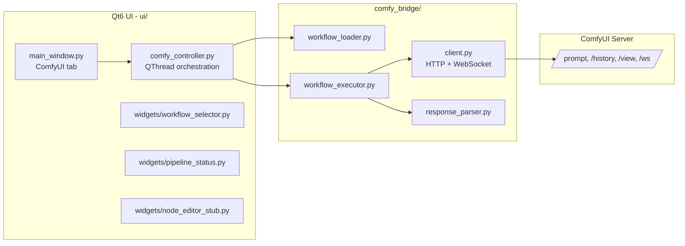

# ComfyUI Integration Layer

This document describes the ComfyUI backend integration added to the Qt6 (PyQt6) video
generation UI.

## Overview



## New file structure

```
comfy_bridge/
├── __init__.py
├── client.py              # ComfyClient: REST + WebSocket transport
├── workflow_loader.py      # WorkflowLoader: reads workflows/*.json
├── workflow_executor.py    # WorkflowExecutor: injects params, runs & streams progress
└── response_parser.py      # ResponseParser: parses ws events + /history output

ui/
├── comfy_controller.py     # ComfyController: Qt-facing facade, runs execution on a QThread
└── widgets/
    ├── __init__.py
    ├── workflow_selector.py  # Dropdown listing workflows/ *.json
    ├── node_editor_stub.py   # Placeholder panel for a future graph editor
    └── pipeline_status.py    # Connection state, progress bar, log view

workflows/
├── flux2_image.json   # placeholder API-format graphs — replace with real exports
├── flux2_video.json
└── sd3_image.json

config/
├── settings.yaml   # general app settings (existing, extended)
└── comfy.yaml      # ComfyUI host/port + workflow defaults
```

`main.py` and the existing `ui/main_window.py`, `ui/pipeline_controller.py`,
`utilis/*` were kept in place — no `src/` re-nesting was introduced since the
project already uses a flat root layout.

## Component responsibilities

- **`ComfyClient`** (`comfy_bridge/client.py`): pure transport. Wraps ComfyUI's
  `/prompt`, `/history/{id}`, `/view`, `/interrupt` REST endpoints and the
  `/ws` WebSocket stream. No workflow-specific knowledge.
- **`WorkflowLoader`** (`comfy_bridge/workflow_loader.py`): lists/loads/saves
  workflow JSON files from `workflows/`.
- **`WorkflowExecutor`** (`comfy_bridge/workflow_executor.py`): applies
  parameter overrides (matched by node id or `_meta.title`) to a loaded graph,
  submits it, and streams progress/completion via callbacks. Runs
  synchronously — intended to be called from a worker thread.
- **`ResponseParser`** (`comfy_bridge/response_parser.py`): turns raw
  WebSocket `progress`/`executing` events and `/history` responses into
  simple `(percent, message)` tuples and output file lists.
- **`ComfyController`** (`ui/comfy_controller.py`): the only object the UI
  talks to. Owns a `ComfyClient`/`WorkflowLoader`/`WorkflowExecutor`, runs
  executions on a `QThread` via an internal `ComfyWorker`, and re-emits
  progress/finished/failed as Qt signals so widgets can connect directly.
- **Widgets** (`ui/widgets/`): `WorkflowSelector` (pick a workflow file),
  `PipelineStatus` (connection indicator, progress bar, log), and
  `NodeEditorStub` (placeholder for a future embedded node graph editor).

## Wiring in `main_window.py`

A new **ComfyUI** tab was added alongside the existing Pipeline/Script/Dubbing/
Preview/Lightbox/Settings tabs (`_build_comfy_tab`). It instantiates
`ComfyController`, `WorkflowSelector`, `PipelineStatus`, and `NodeEditorStub`,
and wires:

- "Check Connection" → `ComfyController.check_connection()` → `connection_changed` signal → `PipelineStatus.set_connected`
- "Run Workflow" → `ComfyController.run_workflow(name)` → `progress`/`finished`/`failed` signals → `PipelineStatus`
- "Cancel" → `ComfyController.cancel()`

## Configuration

`config/comfy.yaml`:

```yaml
host: "127.0.0.1"
port: 8188
workflows_dir: "workflows"
default_workflow: "flux2_image.json"
```

Load it with the existing `utilis.config_loader.ConfigLoader`:

```python
from utilis.config_loader import ConfigLoader
cfg = ConfigLoader("config").load("comfy.yaml")
```

## Workflow JSON files

The three files under `workflows/` are **placeholders** with the correct
API-export shape (`{node_id: {"class_type": ..., "_meta": {"title": ...}, "inputs": {...}}}`).
Replace them with real exports from ComfyUI: in the ComfyUI web UI, enable
**Dev Mode**, then use **Save (API Format)** and drop the resulting JSON into
`workflows/`.

## Parameter injection

`WorkflowExecutor.apply_params(graph, params)` matches `params` keys against
either the node id or the node's `_meta.title` field, e.g.:

```python
params = {
    "Positive Prompt": {"text": "a neon cyberpunk alley, rain, 35mm"},
    "KSampler": {"seed": 12345, "steps": 25},
}
graph = executor.apply_params(graph, params)
```

## Dependencies added

`requests` and `websocket-client` were installed for the HTTP/WebSocket
client. Add them to your requirements file:

```
requests
websocket-client
```

## Local ComfyUI installation

ComfyUI is installed at `F:\VID\ComfyUI` (cloned from
`https://github.com/comfyanonymous/ComfyUI.git`), sharing the app's existing
`F:\VID\venv` environment (already has `torch==2.11.0+cu128`). Its extra
Python dependencies (`transformers`, `scipy`, `kornia`, `alembic`, etc. — the
full `requirements.txt` list minus `torch`/`torchvision`/`torchaudio`/`pyyaml`/
`requests`, which were already present) were installed into that same venv.

`config/comfy.yaml` records the install path:

```yaml
install_dir: "F:/VID/ComfyUI"
python_executable: "F:/VID/venv/Scripts/python.exe"
```

No checkpoints/models were downloaded — `F:\VID\ComfyUI\models\` is empty.
Drop your `.safetensors` checkpoints into the matching subfolders
(`models/checkpoints`, `models/vae`, etc.) before running real generations;
until then, the server runs but any workflow referencing a model will fail
to load it.

## Running

1. Start the ComfyUI server:
   ```powershell
   F:\VID\venv\Scripts\python.exe F:\VID\ComfyUI\main.py --listen 127.0.0.1 --port 8188
   ```
   Wait for `To see the GUI go to: http://127.0.0.1:8188`.
2. Launch this app: `F:\VID\venv\Scripts\python.exe F:\VID\src\main.py`, open
   the **ComfyUI** tab.
3. Click **Check Connection** (should turn green/"connected"), pick a
   workflow, click **Run Workflow**.

Verified end-to-end for this integration: `ComfyClient.is_alive()`,
`get_queue()`, and `ComfyController.check_connection()` all succeed against
the locally running server.

## Installed models (ComfyUI-native)

`F:\VID\ComfyUI\models\` is populated for FLUX.1 (schnell/dev), FLUX.2 Klein-4B,
SDXL base, and SVD-XT:

| Folder | Files | Source |
|---|---|---|
| `checkpoints/` | `sd_xl_base_1.0.safetensors` | downloaded, `stabilityai/stable-diffusion-xl-base-1.0` |
| `checkpoints/` | `svd_xt.safetensors`, `svd_xt_image_decoder.safetensors` | hardlinked from `F:\VID\models\svd\...` |
| `diffusion_models/` | `flux1-dev.safetensors`, `flux1-schnell.safetensors`, `flux2-klein-4b.safetensors` | hardlinked from `F:\VID\models\flux\...` |
| `vae/` | `flux-ae.safetensors` | hardlinked (FLUX.1 vae) |
| `vae/` | `flux2-vae.safetensors` | downloaded, `Comfy-Org/vae-text-encorder-for-flux-klein-4b` |
| `text_encoders/` (aliases `clip/`) | `clip_l.safetensors`, `t5xxl_fp16.safetensors` | downloaded, `comfyanonymous/flux_text_encoders` (FLUX.1) |
| `text_encoders/` | `qwen_3_4b.safetensors` | downloaded, `Comfy-Org/vae-text-encorder-for-flux-klein-4b` (FLUX.2 Klein) |

Hardlinks (NTFS, same volume) were used instead of copies so the ~175GB
already present under `F:\VID\models\` (used by `images/image_generator.py`
via `diffusers`) isn't duplicated — both the diffusers pipeline and ComfyUI
point at the same bytes on disk.

No LoRA or ControlNet models are installed — none are currently referenced
anywhere in this codebase.

The placeholder workflow JSONs in `workflows/` are illustrative stubs (just a
`KSampler` + `CLIPTextEncode` node) and are **not** complete, runnable graphs —
they don't yet include checkpoint/UNETLoader/CLIPLoader/VAELoader/
SaveImage nodes wired to the files above. Build/export real graphs from the
ComfyUI web UI (`http://127.0.0.1:8188`) using **Save (API Format)** once you
want to run an actual generation, referencing the filenames in the table above.

## Real, executable workflow graphs

`workflows/` now contains fully wired, tested ComfyUI API-format graphs (not
stubs) for every installed model:

| File | Model | Params |
|---|---|---|
| `flux1_schnell_image.json` | FLUX.1-schnell (4-step) | `@prompt`, `@seed` |
| `flux1_dev_image.json` | FLUX.1-dev (guidance 3.5) | `@prompt`, `@seed` |
| `flux2_image.json` | FLUX.2 Klein-4B (single Qwen3-4B text encoder, `CLIPLoader` type `"flux2"`) | `@prompt`, `@seed` |
| `sd3_image.json` | SDXL base 1.0 (kept this filename for backwards compat — no SD3 checkpoint is installed) | `@prompt`, `@seed` |
| `flux2_video.json` | Image-to-video via Stable Video Diffusion XT (the only video model installed — FLUX.2 has no video variant) | `@image` (filename already uploaded via `/upload/image`), `@seed` |

All four image graphs were executed end-to-end against the running server
(`ComfyClient.execute_workflow` → `wait_for_result`) and produced correctly
rendered images. The SVD video graph was validated by queuing it (passed
ComfyUI's prompt validation) then interrupted before the full render to save
time — it was not run to completion.

Notes:
- FLUX.1 (`flux1_schnell_image.json`/`flux1_dev_image.json`) uses
  `DualCLIPLoader` with `clip_l.safetensors` + `t5xxl_fp16.safetensors`,
  `type="flux"`.
- FLUX.2 Klein (`flux2_image.json`) uses a single `CLIPLoader` with
  `qwen_3_4b.safetensors`, `type="flux2"` — `DualCLIPLoader` does not support
  a `"flux2"` type in this ComfyUI version.
- A top-level `"_meta_note"` string key (used for documentation in earlier
  stub files) will crash ComfyUI's `/prompt` validator
  (`AttributeError: 'str' object has no attribute 'get'`) because it iterates
  every top-level key as if it were a node. `ComfyClient.execute_workflow`
  now filters the submitted graph to only include dict-valued top-level keys,
  so `_meta_note` fields are safe to keep in the on-disk JSON for
  documentation purposes.

## Follow-ups / not yet implemented

- `NodeEditorStub` is a placeholder; a real embedded node graph editor (or a
  `QWebEngineView` pointing at ComfyUI's own UI) is future work.
- Parameter forms are not auto-generated from the workflow graph yet — UI
  controls need to be built per-workflow or generically inferred from node
  input schemas.
- No authentication/TLS handling for remote ComfyUI servers.
