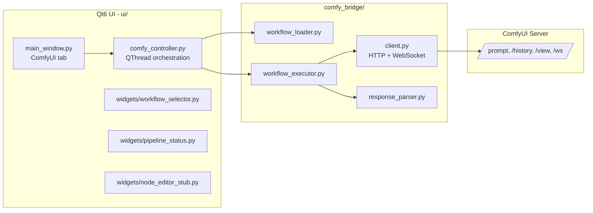

# ComfyUI Integration Layer

This document describes the ComfyUI backend integration added to the Qt6 (PyQt6) video
generation UI.

## Overview



## New file structure

```
comfy_bridge/
├── __init__.py
├── client.py              # ComfyClient: REST + WebSocket transport
├── workflow_loader.py      # WorkflowLoader: reads workflows/*.json
├── workflow_executor.py    # WorkflowExecutor: injects params, runs & streams progress
└── response_parser.py      # ResponseParser: parses ws events + /history output

ui/
├── comfy_controller.py     # ComfyController: Qt-facing facade, runs execution on a QThread
└── widgets/
    ├── __init__.py
    ├── workflow_selector.py  # Dropdown listing workflows/ *.json
    ├── node_editor_stub.py   # Placeholder panel for a future graph editor
    └── pipeline_status.py    # Connection state, progress bar, log view

workflows/
├── flux2_image.json   # placeholder API-format graphs — replace with real exports
├── flux2_video.json
└── sd3_image.json

config/
├── settings.yaml   # general app settings (existing, extended)
└── comfy.yaml      # ComfyUI host/port + workflow defaults
```

`main.py` and the existing `ui/main_window.py`, `ui/pipeline_controller.py`,
`utilis/*` were kept in place — no `src/` re-nesting was introduced since the
project already uses a flat root layout.

## Component responsibilities

- **`ComfyClient`** (`comfy_bridge/client.py`): pure transport. Wraps ComfyUI's
  `/prompt`, `/history/{id}`, `/view`, `/interrupt` REST endpoints and the
  `/ws` WebSocket stream. No workflow-specific knowledge.
- **`WorkflowLoader`** (`comfy_bridge/workflow_loader.py`): lists/loads/saves
  workflow JSON files from `workflows/`.
- **`WorkflowExecutor`** (`comfy_bridge/workflow_executor.py`): applies
  parameter overrides (matched by node id or `_meta.title`) to a loaded graph,
  submits it, and streams progress/completion via callbacks. Runs
  synchronously — intended to be called from a worker thread.
- **`ResponseParser`** (`comfy_bridge/response_parser.py`): turns raw
  WebSocket `progress`/`executing` events and `/history` responses into
  simple `(percent, message)` tuples and output file lists.
- **`ComfyController`** (`ui/comfy_controller.py`): the only object the UI
  talks to. Owns a `ComfyClient`/`WorkflowLoader`/`WorkflowExecutor`, runs
  executions on a `QThread` via an internal `ComfyWorker`, and re-emits
  progress/finished/failed as Qt signals so widgets can connect directly.
- **Widgets** (`ui/widgets/`): `WorkflowSelector` (pick a workflow file),
  `PipelineStatus` (connection indicator, progress bar, log), and
  `NodeEditorStub` (placeholder for a future embedded node graph editor).

## Wiring in `main_window.py`

A new **ComfyUI** tab was added alongside the existing Pipeline/Script/Dubbing/
Preview/Lightbox/Settings tabs (`_build_comfy_tab`). It instantiates
`ComfyController`, `WorkflowSelector`, `PipelineStatus`, and `NodeEditorStub`,
and wires:

- "Check Connection" → `ComfyController.check_connection()` → `connection_changed` signal → `PipelineStatus.set_connected`
- "Run Workflow" → `ComfyController.run_workflow(name)` → `progress`/`finished`/`failed` signals → `PipelineStatus`
- "Cancel" → `ComfyController.cancel()`

## Configuration

`config/comfy.yaml`:

```yaml
host: "127.0.0.1"
port: 8188
workflows_dir: "workflows"
default_workflow: "flux2_image.json"
```

Load it with the existing `utilis.config_loader.ConfigLoader`:

```python
from utilis.config_loader import ConfigLoader
cfg = ConfigLoader("config").load("comfy.yaml")
```

## Workflow JSON files

The three files under `workflows/` are **placeholders** with the correct
API-export shape (`{node_id: {"class_type": ..., "_meta": {"title": ...}, "inputs": {...}}}`).
Replace them with real exports from ComfyUI: in the ComfyUI web UI, enable
**Dev Mode**, then use **Save (API Format)** and drop the resulting JSON into
`workflows/`.

## Parameter injection

`WorkflowExecutor.apply_params(graph, params)` matches `params` keys against
either the node id or the node's `_meta.title` field, e.g.:

```python
params = {
    "Positive Prompt": {"text": "a neon cyberpunk alley, rain, 35mm"},
    "KSampler": {"seed": 12345, "steps": 25},
}
graph = executor.apply_params(graph, params)
```

## Dependencies added

`requests` and `websocket-client` were installed for the HTTP/WebSocket
client. Add them to your requirements file:

```
requests
websocket-client
```

## Running

1. Start ComfyUI (`python main.py` inside the ComfyUI checkout), default
   `http://127.0.0.1:8188`.
2. Launch this app (`python main.py`), open the **ComfyUI** tab.
3. Click **Check Connection**, pick a workflow, click **Run Workflow**.

## Follow-ups / not yet implemented

- `NodeEditorStub` is a placeholder; a real embedded node graph editor (or a
  `QWebEngineView` pointing at ComfyUI's own UI) is future work.
- Parameter forms are not auto-generated from the workflow graph yet — UI
  controls need to be built per-workflow or generically inferred from node
  input schemas.
- No authentication/TLS handling for remote ComfyUI servers.
